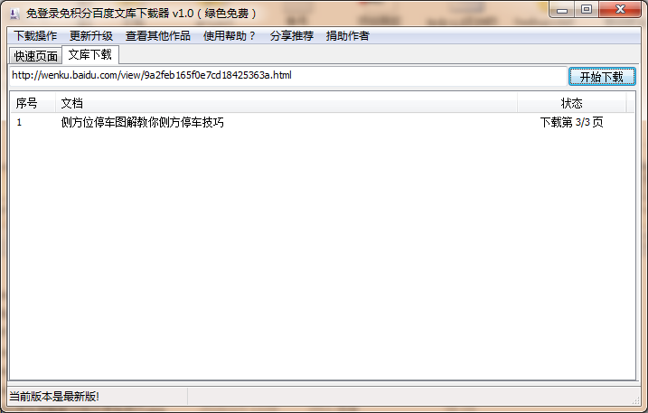
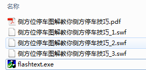
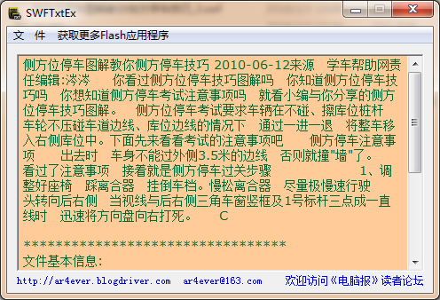

百度文库免积分免登陆下载器

# 使用步骤
## 注册SWFToImage.dll
1. Windows XP/WIN7/win10系统，将SWFToImage.dll复制到C:\Windows\System32目录下，64位系统请将SWFToImage.dll复制到C:\Windows\SysWOW64目录。

2. 打开 开始-运行-输入regsvr32 SWFToImage.dll，回车。

## 运行软件
运行wenkudown.exe，输入文档的网址，例如：http://wenku.baidu.com/view/9a2feb165f0e7cd18425363a.html 点击“开始下载”。

下载中会显示下载的进度，下载完成后会生成一个PDF文件，以及若干SWF文件（Flash动画文件），PDF为图片格式的文档以供阅读。

需要文字材料可以运行flashtext.exe，把任意一个SWF文件拖入到flashtext软件中即可提取出文字。

## 尚待改进
1. 由于SWFToImage.dll不能支持Win8及以上系统，所以工具本身受限，只能支持Windows XP/WIN7，如果你发现有更好的替代工具请告诉我。

2. 如果有提取SWF文件里的文本信息的命令行工具会更好，工具自动提取出文字会更方便。

3. 您有好的办法请告诉我。